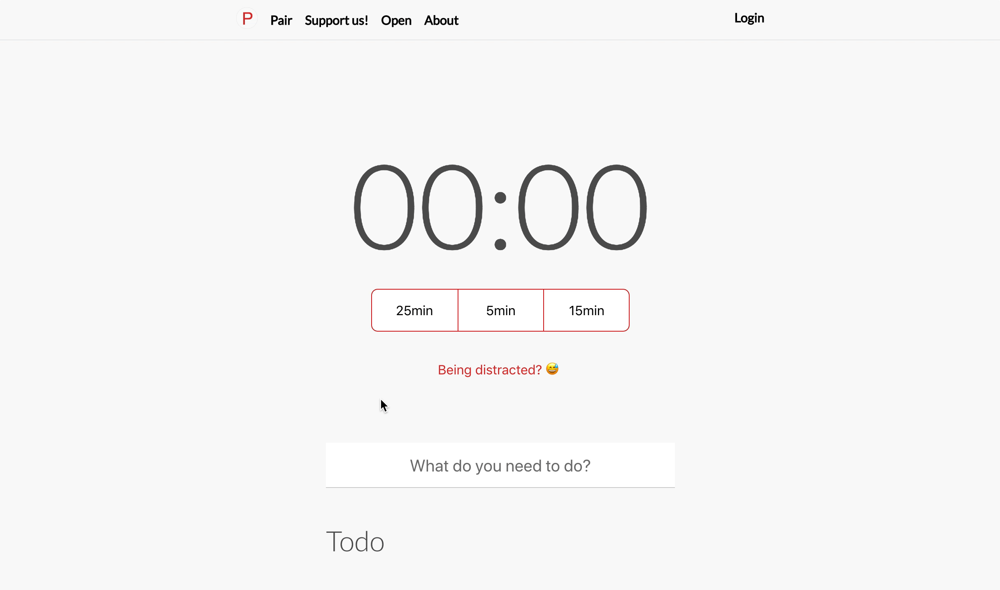

# pomodoro.cc

## Boost your productivity
### Manage your time more effectively

[Pomodoro.cc](http://pomodoro.cc) is an online time tracking tool to plan and review the tasks for the day.

It takes advantage of the guidelines described in the [Pomodoro Technique](http://pomodorotechnique.com) to work more effectively with frequent, mind-refreshing breaks.

## Todo

see open [issues](https://github.com/christian-fei/pomodoro.cc/issues)

## Contributing

View the readme of the service you would like to contribute to :)

Also check out [CONTRIBUTING.md](CONTRIBUTING.
